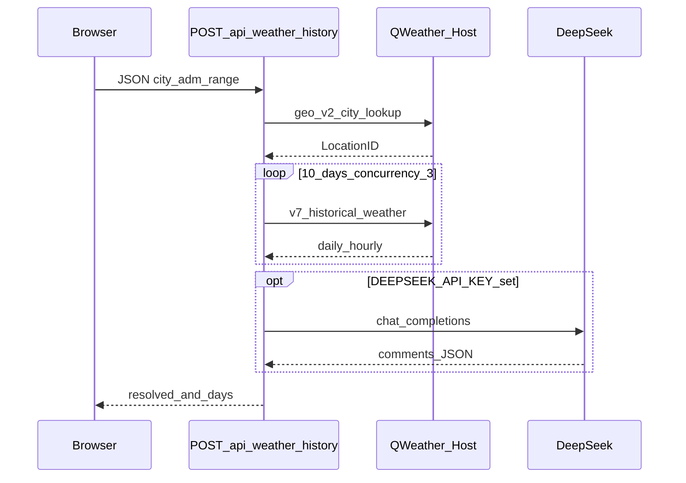

# 近 10 日天气 + 评语

Next.js 应用：通过和风天气 [GeoAPI 城市搜索](https://dev.qweather.com/docs/api/geoapi/city-lookup/) 解析城市，再用 [天气时光机](https://dev.qweather.com/docs/api/time-machine/time-machine-weather/) 拉取**不含今日**的前 **10** 个自然日历史数据；可选调用 [DeepSeek](https://api.deepseek.com/) 为每日生成一句中文短评（失败或未配置时退回和风状况文案）。

详细设计见 [PLAN.md](./PLAN.md)。

---

## 访问路径（子路径部署）

应用配置为 **`basePath: /weather`**，与线上地址一致：

| 环境 | 地址 |
|------|------|
| 生产 | [http://fangdu.chat/weather](http://fangdu.chat/weather) |
| 本地开发 | [http://localhost:3000/weather](http://localhost:3000/weather) |

访问站点根路径 **`/`** 时会 **302 重定向到 `/weather`**，避免误以为部署失败。

前端请求 API 使用 `withBasePath("/api/weather-history")`，实际为 **`/weather/api/weather-history`**。若在 **Nginx / CDN** 后托管，请把以 `/weather` 开头的请求转发到本 Next 进程（并放行 `/_next` 静态资源，见 [Next.js basePath](https://nextjs.org/docs/app/api-reference/next-config-js/basePath)）。

---

## 技术栈

| 层级 | 选型 |
|------|------|
| 框架 | [Next.js](https://nextjs.org/) 16（App Router、`src/app`） |
| UI | [React](https://react.dev/) 19、[Tailwind CSS](https://tailwindcss.com/) 4 |
| 语言 | [TypeScript](https://www.typescriptlang.org/) 5 |
| 天气数据 | [和风天气开发服务](https://dev.qweather.com/docs/api/) — GeoAPI v2、`v7/historical/weather` |
| 鉴权 | 默认 `X-QW-Api-Key`；可选 `Authorization: Bearer`（JWT），见 [身份认证](https://dev.qweather.com/docs/configuration/authentication/) |
| 大模型 | DeepSeek Chat Completions（OpenAI 兼容 HTTP，可选） |
| 质量 | ESLint（`eslint-config-next`） |

---

## 调用逻辑

### 整体数据流

1. 浏览器在 **`/weather`** 首页（`src/app/page.tsx` → `WeatherClient`）填写城市（及可选 `adm` / `range`），`POST` 同源的 **`/weather/api/weather-history`**（由 `src/lib/base-path.ts` 拼接 `basePath`）。
2. **Route Handler**（`src/app/api/weather-history/route.ts`，仅服务端）读取 `QWEATHER_*`、`DEEPSEEK_*` 环境变量，**不向浏览器暴露密钥**。
3. **城市解析**：`src/lib/qweather.ts` 请求 `GET {QWEATHER_API_HOST}/geo/v2/city/lookup`，取匹配结果中的 **LocationID**（当前实现取第一条）。
4. **历史天气**：对「昨天」起连续 10 天的 `yyyyMMdd`（`src/lib/dates.ts`），请求 `GET .../v7/historical/weather?location=&date=`；并发上限为 **3**，单日结果带 **内存短 TTL 缓存**（`src/lib/cache.ts`）。
5. **当日代表状况**：从 `weatherHourly` 中取最接近 **12:00** 的 `text`（`src/lib/hourly-text.ts`），与 `weatherDaily` 的最高/最低温等一并组装为表格行。
6. **评语（可选）**：若配置了 `DEEPSEEK_API_KEY`，`src/lib/deepseek.ts` 将 10 日结构化 JSON **一次**发给 DeepSeek，解析返回的 `comments[]` 填入 `comment`；解析失败或未配置则 `comment` 使用和风状况文案。
7. 响应 JSON 返回前端，客户端渲染表格与错误提示（含 loading 骨架）。

### 序列示意（Mermaid）



### 关键文件

| 路径 | 职责 |
|------|------|
| `src/app/weather-client.tsx` | 表单、loading、结果表、错误展示 |
| `src/app/api/weather-history/route.ts` | 聚合和风 + DeepSeek，返回 JSON |
| `src/lib/qweather.ts` | 和风请求、JWT / API Key 头、`parseQWeatherAuthMode` |
| `src/lib/deepseek.ts` | DeepSeek 调用与 JSON 解析 |
| `src/lib/dates.ts` | 近 10 日 `yyyyMMdd` 范围（不含今天） |
| `src/lib/types.ts` | 前后端共用类型 |

---

## 配置

复制环境变量模板并填写：

```bash
cp .env.example .env.local
```

必填：`QWEATHER_API_HOST`、`QWEATHER_TOKEN`（控制台 **API KEY** 直接粘贴即可）。默认使用 **`X-QW-Api-Key`**（`QWEATHER_AUTH=apikey`）；若凭据是 **JWT**，请设置 `QWEATHER_AUTH=jwt`。可选：`DEEPSEEK_API_KEY`、`DEEPSEEK_BASE_URL`（不配则评语为天气状况原文）。

---

## 开发

```bash
npm install
npm run dev
```

浏览器打开 [http://localhost:3000/weather](http://localhost:3000/weather)（或根路径 [http://localhost:3000/](http://localhost:3000/) 将跳转至 `/weather`），输入城市后查询。

```bash
npm run build   # 生产构建
npm run lint    # 代码检查
```

---

## HTTP API

`POST /weather/api/weather-history`（部署在域名根时完整路径如上；`basePath` 见 `next.config.ts`。）

- **Headers**：`Content-Type: application/json`
- **Body**：`{ "city": "北京", "adm"?: "黑龙江", "range"?: "cn" }`
- **成功**：`200`，body 含 `resolved`（城市信息）与 `days[]`（`date`、`tempMax`/`tempMin`、`condition`、`comment`、`commentSource` 等）
- **常见错误**：`400`（缺 city）、`404`（无匹配城市）、`500`（缺环境变量）、`502`（上游和风/网络异常等）

---

## 合规与来源

气象数据使用请遵守和风 [开发文档](https://dev.qweather.com/docs/api/) 中的**注明来源**与**使用限制**；页脚已提供 QWeather 与文档链接。
